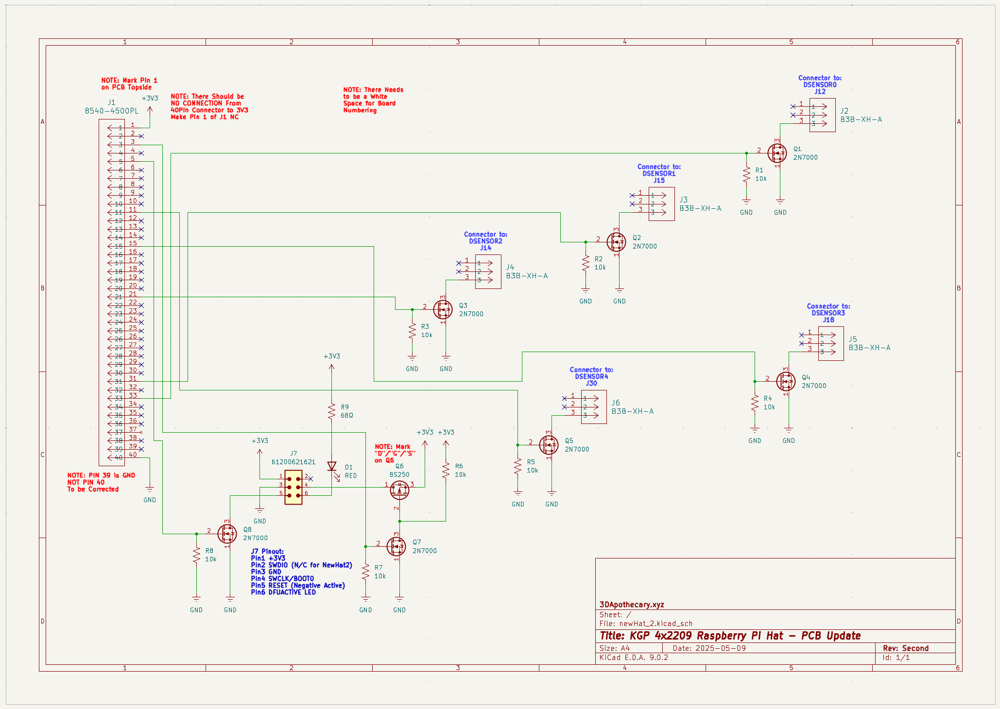
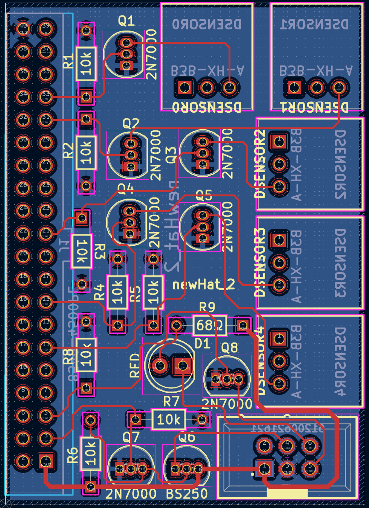

# NewHat2
Raspberry Pi Hat Design that provides Digital Outputs and LED indicator

**NOTE:** This circuit is for use with [KGP Functional Test](https://github.com/3dApothecary-xyz/FunctionalTest) and is only being provided here for reference.  Changes to the circuit and/or PCB may be made without notice.  

